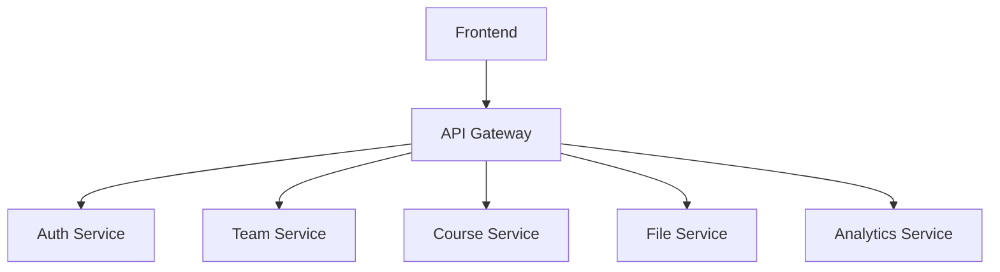

# API Integration Documentation & Solutions

## Table of Contents
1. [API Overview](#api-overview)
2. [Common Issues & Solutions](#common-issues--solutions)
3. [Integration Examples](#integration-examples)
4. [Troubleshooting Guide](#troubleshooting-guide)
5. [Advanced Troubleshooting](#advanced-troubleshooting)
6. [Monitoring & Metrics](#monitoring--metrics)

## API Overview

### Core Services Integration Map



### External Service Integration Status

| Service | Status | Last Verified | Common Issues |
|---------|--------|---------------|---------------|
| BoxyHQ SAML | Active | 2024-12-24 | Connection timeouts |
| Next Auth | Active | 2024-12-24 | Session handling |
| AWS S3 | Pending | - | - |
| OpenAI | Pending | - | - |
| Azure Content Moderator | Pending | - | - |

## Common Issues & Solutions

### 1. BoxyHQ SAML Integration

#### Issue: Connection Timeout
```typescript
// Error:
SAML_CONNECTION_TIMEOUT: Unable to connect to IdP

// Solution:
const samlConfig = {
  timeout: 10000, // Increase timeout
  retryAttempts: 3,
  retryDelay: 1000
}
```

#### Issue: Invalid Configuration
```typescript
// Error:
INVALID_SAML_CONFIG: Missing required fields

// Solution:
const requiredFields = [
  'idpMetadata',
  'callbackUrl',
  'issuer'
]
```

### 2. Next Auth Session Handling

#### Issue: Session Not Persisting
```typescript
// Problem:
Session disappears after page refresh

// Solution:
export const authOptions = {
  session: {
    strategy: "jwt",
    maxAge: 30 * 24 * 60 * 60, // 30 days
  },
  callbacks: {
    async session({ session, token }) {
      session.user.id = token.sub
      return session
    }
  }
}
```

## Integration Examples

### 1. Team Service Integration

```typescript
// Example: Team Creation with Role Management
export async function createTeam({
  name,
  description,
  ownerId
}: CreateTeamInput): Promise<Team> {
  try {
    const team = await prisma.team.create({
      data: {
        name,
        description,
        members: {
          create: {
            userId: ownerId,
            role: 'OWNER'
          }
        }
      }
    })
    
    await logActivity({
      type: 'TEAM_CREATED',
      teamId: team.id,
      userId: ownerId
    })
    
    return team
  } catch (error) {
    logError('TEAM_CREATION_FAILED', error)
    throw new ApiError('TEAM_CREATION_FAILED')
  }
}
```

### 2. File Upload Service

```typescript
// Example: Multi-part File Upload with Progress
export async function uploadFile({
  file,
  teamId,
  onProgress
}: UploadFileInput): Promise<FileMetadata> {
  try {
    const presignedUrl = await getPresignedUrl(file.name)
    
    const upload = axios.create()
    upload.interceptors.request.use(config => {
      config.onUploadProgress = (event) => {
        const progress = (event.loaded / event.total) * 100
        onProgress?.(progress)
      }
      return config
    })

    await upload.put(presignedUrl, file)
    
    return {
      url: presignedUrl.split('?')[0],
      filename: file.name,
      size: file.size,
      teamId
    }
  } catch (error) {
    logError('FILE_UPLOAD_FAILED', error)
    throw new ApiError('FILE_UPLOAD_FAILED')
  }
}
```

## Troubleshooting Guide

### 1. API Response Codes

| Code | Meaning | Action Required |
|------|---------|----------------|
| 401  | Unauthorized | Check authentication token |
| 403  | Forbidden | Verify user permissions |
| 404  | Not Found | Validate resource exists |
| 429  | Rate Limited | Implement backoff strategy |

### 2. Common Error Patterns

```typescript
// 1. Authentication Errors
if (error.code === 'AUTH_REQUIRED') {
  // Redirect to login
  return redirect('/auth/login')
}

// 2. Permission Errors
if (error.code === 'INSUFFICIENT_PERMISSIONS') {
  // Show upgrade prompt
  return showUpgradeModal()
}

// 3. Rate Limiting
if (error.code === 'RATE_LIMITED') {
  // Implement exponential backoff
  await exponentialBackoff(retryCount)
}
```

### 3. Integration Checklist

- [ ] Environment variables configured
- [ ] API endpoints verified
- [ ] Error handling implemented
- [ ] Rate limiting considered
- [ ] Logging configured
- [ ] Monitoring setup
- [ ] Documentation updated

## Advanced Troubleshooting

### 1. System Health Checks

```typescript
// Health Check Implementation
export async function healthCheck(): Promise<HealthStatus> {
  const checks = await Promise.allSettled([
    checkDatabase(),
    checkRedis(),
    checkS3(),
    checkSAML(),
    checkOpenAI()
  ])

  return {
    status: checks.every(check => check.status === 'fulfilled') ? 'healthy' : 'degraded',
    services: checks.map((check, index) => ({
      name: ['database', 'redis', 's3', 'saml', 'openai'][index],
      status: check.status === 'fulfilled' ? 'up' : 'down',
      latency: check.status === 'fulfilled' ? check.value.latency : null,
      lastChecked: new Date().toISOString()
    }))
  }
}

// Individual Service Checks
async function checkDatabase() {
  const start = performance.now()
  await prisma.$queryRaw`SELECT 1`
  return { latency: performance.now() - start }
}
```

### 2. Error Tracking Patterns

```typescript
// Error Classification System
const ErrorSeverity = {
  CRITICAL: 'CRITICAL',   // System down
  HIGH: 'HIGH',          // Feature broken
  MEDIUM: 'MEDIUM',      // Degraded performance
  LOW: 'LOW'            // Minor issue
} as const

// Structured Error Logging
interface ErrorLog {
  id: string
  timestamp: Date
  severity: keyof typeof ErrorSeverity
  code: string
  message: string
  stack?: string
  context: {
    userId?: string
    teamId?: string
    environment: string
    request?: {
      method: string
      path: string
      params: Record<string, any>
    }
  }
  metadata: Record<string, any>
}

// Error Tracking Implementation
export async function logError(error: Error, context: Partial<ErrorLog['context']>) {
  const errorLog: ErrorLog = {
    id: nanoid(),
    timestamp: new Date(),
    severity: classifyError(error),
    code: error.name,
    message: error.message,
    stack: error.stack,
    context: {
      environment: process.env.NODE_ENV,
      ...context
    },
    metadata: extractMetadata(error)
  }

  // Log to multiple destinations
  await Promise.all([
    logToSentry(errorLog),
    logToDatabase(errorLog),
    notifyIfCritical(errorLog)
  ])
}
```

## Monitoring & Metrics

### 1. Performance Monitoring

```typescript
// Performance Middleware
export const withPerformanceTracking = createMiddleware(async (req, res, next) => {
  const start = performance.now()
  const route = req.url
  
  // Track memory usage
  const baseMemory = process.memoryUsage()
  
  try {
    await next()
  } finally {
    const end = performance.now()
    const duration = end - start
    
    // Calculate memory delta
    const endMemory = process.memoryUsage()
    const memoryDelta = {
      heapUsed: endMemory.heapUsed - baseMemory.heapUsed,
      external: endMemory.external - baseMemory.external
    }
    
    await recordMetrics({
      route,
      duration,
      memoryDelta,
      timestamp: new Date(),
      status: res.statusCode
    })
  }
})

// Custom Metrics Collection
interface RouteMetrics {
  route: string
  timestamp: Date
  duration: number
  memory: {
    heapUsed: number
    external: number
  }
  status: number
}

const metricAggregator = {
  async record(metrics: RouteMetrics) {
    await Promise.all([
      redis.lpush('recent_metrics', JSON.stringify(metrics)),
      updateAverages(metrics),
      checkThresholds(metrics)
    ])
  }
}
```

### 2. Real-time Monitoring Dashboard

```typescript
// WebSocket-based Metrics Stream
export class MetricsStream {
  private clients: Set<WebSocket> = new Set()

  addClient(ws: WebSocket) {
    this.clients.add(ws)
    ws.on('close', () => this.clients.delete(ws))
  }

  broadcast(metrics: any) {
    const payload = JSON.stringify(metrics)
    this.clients.forEach(client => {
      if (client.readyState === WebSocket.OPEN) {
        client.send(payload)
      }
    })
  }
}

// Metrics Aggregation
interface AggregatedMetrics {
  timestamp: Date
  window: '1m' | '5m' | '1h' | '1d'
  metrics: {
    requestCount: number
    averageLatency: number
    errorRate: number
    memoryUsage: number
    activeUsers: number
  }
}

async function aggregateMetrics(window: AggregatedMetrics['window']): Promise<AggregatedMetrics> {
  // Implementation
}
```

### 3. Alert System

```typescript
// Alert Configuration
interface AlertConfig {
  metric: string
  threshold: number
  window: '1m' | '5m' | '1h'
  severity: 'critical' | 'warning' | 'info'
  channels: ('slack' | 'email' | 'sms')[]
}

const alertConfigs: AlertConfig[] = [
  {
    metric: 'errorRate',
    threshold: 0.05, // 5% error rate
    window: '5m',
    severity: 'critical',
    channels: ['slack', 'sms']
  },
  {
    metric: 'averageLatency',
    threshold: 1000, // 1s response time
    window: '1m',
    severity: 'warning',
    channels: ['slack']
  }
]

// Alert Manager
class AlertManager {
  private activeAlerts: Map<string, Alert> = new Map()

  async checkThresholds(metrics: AggregatedMetrics) {
    for (const config of alertConfigs) {
      const value = metrics.metrics[config.metric as keyof typeof metrics.metrics]
      if (value > config.threshold) {
        await this.triggerAlert(config, value)
      }
    }
  }

  private async triggerAlert(config: AlertConfig, value: number) {
    const alert = {
      id: nanoid(),
      config,
      value,
      timestamp: new Date()
    }

    if (!this.activeAlerts.has(config.metric)) {
      this.activeAlerts.set(config.metric, alert)
      await this.notifyChannels(alert)
    }
  }
}
```

### 4. Performance Optimization Guide

#### Common Issues and Solutions

1. **High Latency**
   - Cache frequently accessed data
   - Optimize database queries
   - Use connection pooling
   - Implement CDN for static assets

2. **Memory Leaks**
   - Monitor heap snapshots
   - Implement proper cleanup
   - Use WeakMap/WeakSet
   - Regular garbage collection

3. **Database Performance**
   - Index optimization
   - Query optimization
   - Connection pooling
   - Read replicas

4. **API Response Times**
   - Response compression
   - Pagination
   - Field selection
   - Batch operations

### 5. Monitoring Checklist

- [ ] Set up Sentry error tracking
- [ ] Configure performance monitoring
- [ ] Implement health checks
- [ ] Set up alert system
- [ ] Create monitoring dashboard
- [ ] Configure log aggregation
- [ ] Set up metric collection
- [ ] Implement alert notifications

### 6. Metrics to Track

1. **System Metrics**
   - CPU usage
   - Memory usage
   - Disk I/O
   - Network I/O

2. **Application Metrics**
   - Request rate
   - Error rate
   - Response time
   - Active users

3. **Business Metrics**
   - User signups
   - Active teams
   - Feature usage
   - Conversion rates

4. **Infrastructure Metrics**
   - Server health
   - Database performance
   - Cache hit rates
   - CDN performance

## Note for Updates

When adding new integration solutions:
1. Document the exact error message
2. Provide minimal reproduction steps
3. Include working solution code
4. Add any relevant configuration
5. Update the status table
6. Add to troubleshooting guide

## References

- [BoxyHQ Documentation](https://boxy.wiki/docs/jackson/overview)
- [Next Auth Guide](https://next-auth.js.org/)
- [Prisma Documentation](https://www.prisma.io/docs/)
- [AWS S3 SDK Guide](https://docs.aws.amazon.com/AWSJavaScriptSDK/v3/latest/clients/client-s3/)
- [OpenAI API Reference](https://platform.openai.com/docs/api-reference)
- [Azure Content Moderator](https://learn.microsoft.com/en-us/azure/cognitive-services/content-moderator/)
