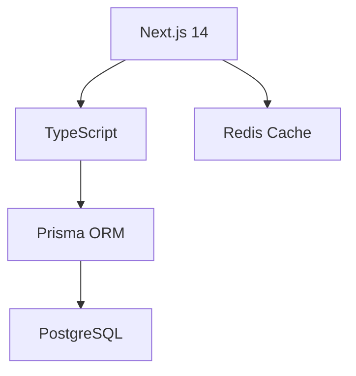
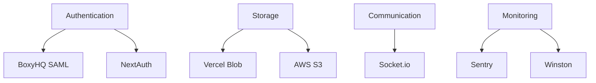
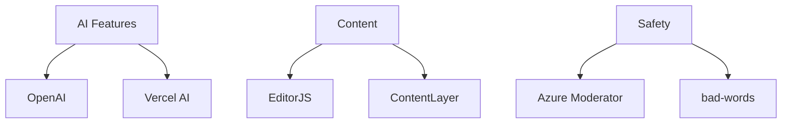

# Blueprint Club V3: Architecture Specification

## Document Purpose
This document outlines the architectural decisions, technology choices, and development principles for Blueprint Club V3.

## Quick Reference
- Feature Specifications → `structured.md`
- Timeline & Phases → `version3.md`
- Philosophy & Method → `method.md`
- Architecture & Stack → This document (`architecture.md`)

## System Architecture

### Technology Stack
1. **Frontend**
   - Framework: Next.js 14
   - UI Components: shadcn/ui
   - State Management: TBD
   - Data Fetching: TBD

2. **Backend**
   - Runtime: Node.js
   - Database: PostgreSQL
   - ORM: Prisma
   - Caching: Redis

3. **Infrastructure**
   - Cloud Provider: TBD
   - Deployment: TBD
   - CI/CD: TBD
   - Monitoring: TBD

### Core Dependencies
[To be discussed and detailed]

### Integration Points
[To be discussed and detailed]

### Development Principles
[To be discussed and detailed]

### Cost Analysis
[To be discussed and detailed]

### Scaling Strategy
[To be discussed and detailed]

## Next Steps
1. Review and finalize technology choices
2. Detail integration strategies
3. Define development principles
4. Create cost projections

## Blueprint Club V3 Architecture

### Dependency Architecture

### 1. Core Layer (Required by All Features)

**Core Dependencies**:
- Next.js 14 (App Router)
- TypeScript
- Prisma ORM
- PostgreSQL
- Redis
- TailwindCSS
- RadixUI

### 2. Service Layer (Shared by Multiple Features)

**Service Dependencies**:
- Authentication: BoxyHQ, NextAuth
- Storage: Vercel Blob, S3
- Communication: Socket.io
- Monitoring: Sentry, Winston
- Caching: Redis, Memory
- Search: MeiliSearch

### 3. Feature-Specific Layer

**Feature Dependencies**:
- AI: OpenAI, Vercel AI
- Content: EditorJS, ContentLayer
- Safety: Azure Moderator, bad-words
- UI: shadcn/ui, Framer Motion
- Forms: React Hook Form, Zod

## Development Phases

### Phase 1: Foundation (4-6 weeks)
**Objective**: Set up core infrastructure and services

1. **Core Setup**
   - Next.js project configuration
   - TypeScript setup
   - Database schema design
   - Redis cache configuration

2. **Authentication**
   - BoxyHQ SAML integration
   - NextAuth setup
   - User management system
   - Session handling

3. **Infrastructure**
   - API route structure
   - Middleware setup
   - Error handling
   - Logging system

4. **Monitoring**
   - Sentry integration
   - Winston logger setup
   - Performance monitoring
   - Health checks

### Phase 2: Feature Testing (6-8 weeks)
**Objective**: Implement and test all major features with mock data

1. **API Development**
   - Authentication endpoints
   - Team management
   - Course management
   - Assessment system
   - File management
   - Real-time features

2. **Mock Implementation**
   - Mock data generation
   - Test routes
   - Basic UI components
   - Feature integration

3. **Testing**
   - Unit tests
   - Integration tests
   - Performance tests
   - Load testing

### Phase 3: Production Ready (6-8 weeks)
**Objective**: Finalize UI/UX and prepare for production

1. **UI/UX Development**
   - Component library
   - Responsive design
   - Animations
   - Theme system

2. **Data Integration**
   - Real data migration
   - Data validation
   - Performance optimization
   - Cache implementation

3. **Production Preparation**
   - Security hardening
   - Documentation
   - Deployment setup
   - Monitoring configuration

## Feature Implementation Matrix

| Feature | Core Dependencies | Service Dependencies | Feature Dependencies | Phase |
|---------|------------------|---------------------|---------------------|-------|
| Authentication | Next.js, Prisma | BoxyHQ, NextAuth | - | 1 |
| Team Management | Next.js, Prisma | Socket.io | - | 1 |
| Course System | Next.js, Prisma | Vercel Blob | EditorJS | 2 |
| Assessment | Next.js, Prisma | - | - | 2 |
| AI Chat | Next.js, Redis | Socket.io | OpenAI, Vercel AI | 2 |
| File Management | Next.js, Prisma | S3, Vercel Blob | - | 2 |
| Child Safety | Next.js, Prisma | - | Azure Moderator | 3 |
| Analytics | Next.js, Redis | - | - | 3 |
| Social Features | Next.js, Prisma | Socket.io | - | 3 |

## Cost Control Strategy

### 1. Development Phase
- Use free tiers
- Local development
- Mock external services
- Minimal cloud usage

### 2. Testing Phase
- Controlled test data
- Usage monitoring
- Cost tracking
- Resource optimization

### 3. Production Phase
- Gradual scaling
- Usage-based upgrades
- Performance optimization
- Resource monitoring

## Note for Implementation
1. Start with core dependencies
2. Add service layer gradually
3. Feature-specific dependencies only when needed
4. Monitor usage and costs
5. Optimize as you scale
