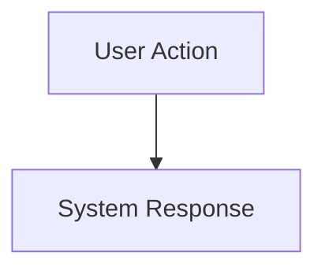
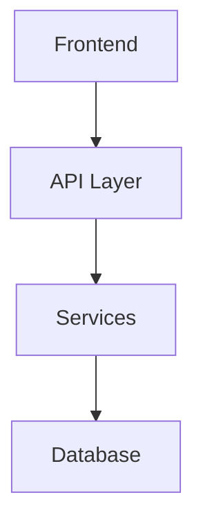

# Feature Documentation Template

## Related Documentation
- [Project Structure](./structured.md): Core 7-point implementation approach
- [V3 Implementation](./implementation-ver3.md): Overall project guidelines
- [Feature 1: AI Tutor](./feature1.md): Reference implementation
- [Architecture](./architecture.md): System architecture decisions
- [Addon Features](./addon-features.md): Available boilerplate features

## Session Checkpoint
**Last Session**: December 25, 2023 23:24 IST
**Current Feature**: AI Tutor Integration
**Status**: Initial implementation complete
**Next Steps**: Voice streaming integration

### Completed Components
1. Teacher Card Component
2. Whiteboard Component
3. Math Renderer
4. Animation System

### Pending Tasks
1. Voice Streaming Integration
2. Teacher Avatar Generation
3. Enhanced Math Features

### Current Dependencies
```json
{
  "@google/generative-ai": "^0.1.0",
  "elevenlabs-node": "^1.0.0",
  "framer-motion": "^10.16.4",
  "katex": "^0.16.9"
}
```

## 1. Core Infrastructure 🏗️

### Database Schema
```prisma
// Prisma models and relationships
```

### Authentication & Security
- Required permissions
- Rate limiting
- Data access controls

### Monitoring Setup
- Key metrics
- Alert thresholds
- Logging strategy

## 2. User Experience 🎨

### UI Components
- Component tree
- State management
- Animation system

### Interaction Flow


### Accessibility
- WCAG compliance
- Keyboard navigation
- Screen reader support

## 3. Enterprise Integration 🏢

### SAML Integration
- SSO requirements
- Team permissions
- Directory sync

### Audit Logging
- Event tracking
- Compliance requirements
- Data retention

### Multi-tenant Support
- Data isolation
- Resource limits
- Tenant configuration

## 4. Technical Implementation 💻

### Architecture


### Dependencies
```json
{
  "dependencies": {},
  "devDependencies": {}
}
```

### API Endpoints
```typescript
interface Endpoints {
  // API definitions
}
```

## 5. Performance Optimization ⚡

### Caching Strategy
- Cache layers
- Invalidation rules
- Storage limits

### Load Testing
- Performance targets
- Test scenarios
- Bottlenecks

### Optimization Techniques
- Code splitting
- Resource loading
- Database indexing

## 6. Testing Strategy 🧪

### Unit Tests
```typescript
describe('Feature', () => {
  // Test cases
});
```

### Integration Tests
- API testing
- Service integration
- Error handling

### E2E Testing
- User flows
- Edge cases
- Performance metrics

## 7. Documentation & Maintenance 📚

### Developer Guide
- Setup instructions
- API documentation
- Common issues

### Deployment Process
- Environment setup
- Migration steps
- Rollback procedures

### Monitoring Guide
- Health checks
- Alert responses
- Maintenance tasks

## Version Control

### Branch Strategy
```
feature/
├── development
├── staging
└── production
```

### Release Process
1. Feature branches
2. Integration testing
3. Staging deployment
4. Production release

## Future Enhancements

### Planned Features
1. Feature A
2. Feature B
3. Feature C

### Integration Points
- System A
- System B
- System C

### Technical Debt
- Known issues
- Improvement areas
- Refactoring needs
