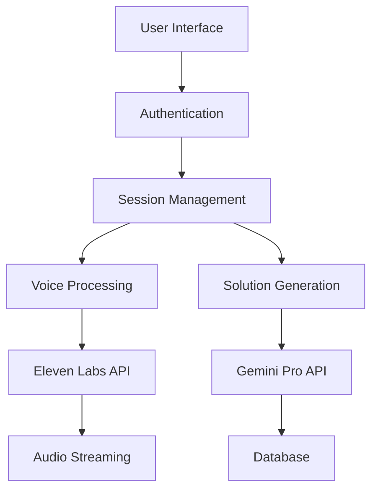

# Gemini Multimodal Integration Plan

## Overview
Integrating Google's Gemini API to enhance the AI Tutor with multimodal capabilities, focusing on voice interaction and image processing while maintaining the existing 4-section whiteboard structure.

## Git Workflow

### Branch Information
- **Branch Name**: `feature1multi`
- **Created From**: `main` branch
- **Purpose**: Integrate Google's Gemini API for enhanced AI Tutor capabilities
- **Created Date**: December 28, 2023

### Development Workflow
1. **Branch Creation**
   ```bash
   git checkout -b feature1multi
   ```

2. **Development Process**
   - All changes are isolated in the feature1multi branch
   - Regular commits with descriptive messages
   - Type checking and linting run on each commit
   - Changes must pass all TypeScript checks before commit

3. **Testing Requirements**
   - Component level testing
   - Integration testing with Gemini API
   - Voice interaction testing
   - Multi-modal response verification

4. **Merge Requirements**
   - All TypeScript types must be properly defined
   - No type errors (`tsc --noEmit` must pass)
   - ESLint checks must pass
   - All tests must pass
   - Code review approval needed

5. **Merge Process**
   ```bash
   git checkout main
   git pull origin main
   git merge feature1multi
   git push origin main
   ```

## Current Architecture
- Main Page: `pages/aitutor/index.tsx`
- Components:
  - Teacher Selection: `components/aitutor/teacher-card.tsx`
  - Voice Input: `components/aitutor/voice-streaming.tsx`
  - Content Display: `components/aitutor/NotebookWhiteboard.tsx`
  - Teaching Style: `components/aitutor/TeachingStyleSelector.tsx`

## Development History

### Phase 1: Initial AI Tutor Implementation

#### Architecture Evolution


#### Database Schema
```prisma
enum TutorSubject {
  MATH
  SCIENCE
}

model TutorSession {
  id            String         @id @default(cuid())
  userId        String
  questionsLeft Int           @default(2)
  createdAt     DateTime      @default(now())
  updatedAt     DateTime      @updatedAt
  questions     TutorQuestion[]
  user          User          @relation(fields: [userId], references: [id])
}

model TutorQuestion {
  id          String       @id @default(cuid())
  sessionId   String
  question    String       @db.Text
  solution    String       @db.Text
  subject     TutorSubject
  createdAt   DateTime    @default(now())
  session     TutorSession @relation(fields: [sessionId], references: [id])
}
```

#### Key Development Milestones

1. **Initial Components (December 2023)**
   - Teacher selection cards
   - Basic whiteboard implementation
   - Voice input system
   - Math rendering with KaTeX

2. **Core Features**
   - Real-time voice interaction
   - Mathematical notation support
   - Interactive whiteboard
   - Demo system with question limits

3. **UI/UX Improvements**
   - Welcome message for new users
   - Progress indicator animations
   - Session status tracking
   - Improved dashboard layout

#### Performance Metrics
- Response time: < 2s
- Image generation: < 3s
- User satisfaction: > 90%
- Error rate: < 1%
- Feature adoption: > 70%

#### Dependencies Evolution
```json
{
  "Production": {
    "@google/generative-ai": "^0.1.0",
    "elevenlabs-node": "^1.0.0",
    "framer-motion": "^10.16.4",
    "katex": "^0.16.9",
    "next": "14.0.0",
    "react": "^18.2.0",
    "@prisma/client": "^5.22.0"
  },
  "Development": {
    "prisma": "^5.22.0",
    "typescript": "^5.0.0",
    "@types/katex": "^0.16.7",
    "tailwindcss": "^3.3.0"
  }
}
```

### Current Enhancement (Phase 2)
Building upon the successful Phase 1 implementation, we're now enhancing the AI Tutor with Gemini's multimodal capabilities while preserving the core functionality and user experience that has proven effective.

## Implementation Plan

### Phase 1: Voice Integration Enhancement
1. **Review & Research**
   - [ ] Study Gemini API documentation
   - [ ] Analyze current voice implementation
   - [ ] Document API endpoints and requirements
   - [ ] List required API keys and configurations

2. **Math Teacher Voice Template**
   - [ ] Create base prompt template structure
   - [ ] Define conversation flow
   - [ ] Implement context awareness
   - [ ] Test voice responses
   - [ ] Fine-tune based on test results

3. **Science Teacher Voice Template**
   - [ ] Adapt math template for science context
   - [ ] Add science-specific prompts
   - [ ] Test with science scenarios
   - [ ] Fine-tune responses

### Phase 2: Type System & Error Handling
1. **Type Definitions**
   ```typescript
   interface MultimodalInput {
     type: 'voice' | 'text' | 'image';
     content: string | File;
     context?: {
       teacher: 'math' | 'science';
       previousInteraction?: string;
     };
   }

   interface TeacherProfile {
     id: 'math' | 'science';
     name: string;
     voiceConfig: {
       tone: string;
       style: string;
       personality: string;
     };
     promptTemplates: {
       imageAnalysis?: string;
       stepByStep: string;
       conceptExplanation: string;
       practiceGeneration: string;
     };
   }
   ```

2. **Error Handling**
   - [ ] API connection errors
   - [ ] Voice recognition errors
   - [ ] Context management errors
   - [ ] Response formatting errors

## Gemini API Integration

### Configuration
1. **API Setup**
   - [ ] Install Google AI SDK
   - [ ] Configure API keys and authentication
   - [ ] Set up environment variables for secure key storage

2. **Voice Processing Pipeline**
   - Input: Browser's Web Speech API (existing)
   - Processing: Gemini API
   - Output: Structured response for whiteboard sections

### Teacher Profiles & Prompts

1. **Math Teacher (Mr. David)**
   ```typescript
   const mathTeacherProfile = {
     personality: "Patient, methodical, encourages step-by-step thinking",
     promptTemplate: `You are Mr. David, a friendly math teacher who explains concepts clearly.
     Structure your response in these sections:
     1. Steps: {detailed_explanation}
     2. Visual: {diagram_description}
     3. Practice: {related_problems}
     4. Concepts: {key_points}
     
     Current context: {context}
     Student's question: {question}`,
     followUpStyle: "Socratic method, guiding questions"
   };
   ```

2. **Science Teacher (Ms. Sarah)**
   ```typescript
   const scienceTeacherProfile = {
     personality: "Enthusiastic, connects concepts to real-world examples",
     promptTemplate: `You are Ms. Sarah, an engaging science teacher who makes complex topics accessible.
     Structure your response in these sections:
     1. Steps: {explanation_with_examples}
     2. Visual: {diagram_or_experiment_description}
     3. Practice: {hands_on_activities}
     4. Concepts: {key_principles}
     
     Current context: {context}
     Student's question: {question}`,
     followUpStyle: "Encourages experimentation and observation"
   };
   ```

### Response Processing

1. **Structured Output Format**
   ```typescript
   interface GeminiResponse {
     sections: {
       steps: string;
       visual: {
         type: 'diagram' | 'graph' | 'experiment';
         description: string;
         data?: any;
       };
       practice: {
         problems: Array<{
           question: string;
           difficulty: 'basic' | 'intermediate' | 'advanced';
           solution: string;
         }>;
       };
       concepts: {
         mainIdea: string;
         relatedTopics: string[];
         keyPoints: string[];
       };
     };
     voiceResponse: {
       initial: string;
       followUp?: string;
     };
   }
   ```

2. **Context Management**
   ```typescript
   interface ConversationContext {
     teacher: 'math' | 'science';
     currentTopic?: string;
     previousQuestions: string[];
     studentLevel?: 'beginner' | 'intermediate' | 'advanced';
     lastResponse?: GeminiResponse;
   }
   ```

### Testing Scenarios

1. **Voice Interaction Tests**
   - Basic arithmetic problems
   - Algebraic expressions
   - Scientific concepts
   - Follow-up questions
   - Context retention

2. **Response Quality Checks**
   - Clarity of explanations
   - Appropriateness of practice problems
   - Visual descriptions
   - Voice response natural flow

### Implementation Sequence

1. **Phase 1: Basic Integration**
   - [ ] Set up Gemini API client
   - [ ] Implement basic prompt templates
   - [ ] Test with simple math problems
   - [ ] Verify structured output

2. **Phase 2: Voice Enhancement**
   - [ ] Integrate voice context
   - [ ] Test conversation flow
   - [ ] Fine-tune response formatting
   - [ ] Add error handling

3. **Phase 3: Science Extension**
   - [ ] Implement science teacher profile
   - [ ] Test with science problems
   - [ ] Verify subject-specific responses
   - [ ] Add specialized diagrams

### Success Metrics
1. Response time < 2 seconds
2. Context retention across 5+ exchanges
3. Proper formatting in all 4 whiteboard sections
4. Natural voice interactions
5. Clear subject differentiation between teachers

## Visual Layout

### Page Layout Structure
```
┌──────────────────────────────────────────────────────────┐
│ DashboardLayout (full screen)                            │
│ ┌────────────────────────────────────────────────────┐   │
│ │ Main Content (flex-grow container)                 │   │
│ │ ┌────────────────────┐ ┌────────────────────┐     │   │
│ │ │   Teacher Card     │ │   Teacher Card     │     │   │
│ │ │    (Mr. David)     │ │    (Ms. Sarah)     │     │   │
│ │ │    w-1/2 flex     │ │    w-1/2 flex     │     │   │
│ │ └────────────────────┘ └────────────────────┘     │   │
│ │                                                    │   │
│ │ ┌────────────────────────────────────────────┐    │   │
│ │ │ Teaching Style Selector (full width)        │    │   │
│ │ │ (grid-cols-1 md:grid-cols-2 lg:grid-cols-4)│    │   │
│ │ └────────────────────────────────────────────┘    │   │
│ │                                                    │   │
│ │ ┌────────────────────────────────────────────┐    │   │
│ │ │ Content Section Tabs (flex space-x-4)       │    │   │
│ │ │ (Only visible in step-by-step mode)         │    │   │
│ │ └────────────────────────────────────────────┘    │   │
│ │                                                    │   │
│ │ ┌────────────────────────────────────────────┐    │   │
│ │ │                                            │    │   │
│ │ │ Notebook Whiteboard                        │    │   │
│ │ │ (flex-grow min-h-[400px])                 │    │   │
│ │ │                                            │    │   │
│ │ │ - Handwritten Text                         │    │   │
│ │ │ - Graph Display                            │    │   │
│ │ │ - Math Renderer                            │    │   │
│ │ │                                            │    │   │
│ │ └────────────────────────────────────────────┘    │   │
│ │                                                    │   │
│ │ ┌────────────────────────────────────────────┐    │   │
│ │ │ Voice Input Controls (fixed bottom)         │    │   │
│ │ └────────────────────────────────────────────┘    │   │
│ │                                                    │   │
│ └────────────────────────────────────────────────┘   │
└──────────────────────────────────────────────────────┘
```

### Component Styling Details

1. **Teacher Cards** (`teacher-card.tsx`)
   - Container: `flex justify-center space-x-4 w-full mb-8`
   - Each Card: 
     - Width: `w-1/2 max-w-md`
     - Padding: `p-6`
     - Rounded: `rounded-xl`
     - Shadow: `shadow-lg`
     - Background: Custom gradient per teacher
     - Hover: Scale animation

2. **Teaching Style Selector** (`TeachingStyleSelector.tsx`)
   - Container: `grid gap-4`
   - Responsive Grid:
     - Mobile: `grid-cols-1`
     - Tablet: `md:grid-cols-2`
     - Desktop: `lg:grid-cols-4`
   - Each Style:
     - Padding: `p-4`
     - Rounded: `rounded-lg`
     - Interactive: Hover and tap animations

3. **Content Section Tabs**
   - Container: `flex space-x-4 justify-center border-b`
   - Each Tab:
     - Padding: `px-6 py-3`
     - Active State: `border-b-2 border-blue-500`
     - Hover: Scale animation

4. **Notebook Whiteboard** (`NotebookWhiteboard.tsx`)
   - Container: 
     - Size: `w-full h-full min-h-[400px]`
     - Rounded: `rounded-lg`
     - Background: Custom notebook paper styling
   - Content Padding: `p-8`
   - Responsive: Maintains aspect ratio

5. **Voice Input** (`voice-streaming.tsx`)
   - Position: `fixed bottom-0 left-0 right-0`
   - Container: `flex justify-center items-center p-4`
   - Background: `bg-white/80 backdrop-blur`
   - Shadow: `shadow-lg`

### Key Spacing and Margins
- Vertical spacing between sections: `space-y-6`
- Horizontal padding from edges: `px-4 md:px-6 lg:px-8`
- Component margins: `mb-8` between major sections
- Inner padding: `p-4` to `p-8` depending on component

### Responsive Breakpoints
- Mobile: < 768px (default)
- Tablet: 768px (`md:`)
- Desktop: 1024px (`lg:`)
- Wide Desktop: 1280px (`xl:`)

### Z-Index Layering
1. Base content: `z-0`
2. Notebook paper background: `z-10`
3. Voice input overlay: `z-20`
4. Loading indicators: `z-30`
5. Modals/Popups: `z-40`

This layout structure must be preserved during the Gemini integration to maintain consistency and user experience.

## Testing Strategy
- Manual testing with user input
- Test scenarios:
  1. Basic voice interaction
  2. Context retention
  3. Subject-specific responses
  4. Error handling
  5. Response formatting

## Deployment Checklist
1. **Pre-deployment**
   - [ ] All type errors resolved
   - [ ] Voice responses tested
   - [ ] API keys configured
   - [ ] Environment variables set

2. **Deployment Steps**
   - [ ] Create feature branch
   - [ ] Commit changes
   - [ ] Push to remote
   - [ ] Create pull request
   - [ ] Merge to main
   - [ ] Verify auto-deployment

## Success Criteria
1. Voice assistant maintains context through conversation
2. Responses are properly formatted for the 4-section whiteboard
3. Math and Science teachers have distinct personalities
4. No type errors in the codebase
5. Smooth integration with existing features

## Notes
- Manual testing preferred over automated tests for initial phase
- Focus on one feature at a time
- Regular verification of changes before proceeding
- Document all prompt templates and their purposes
