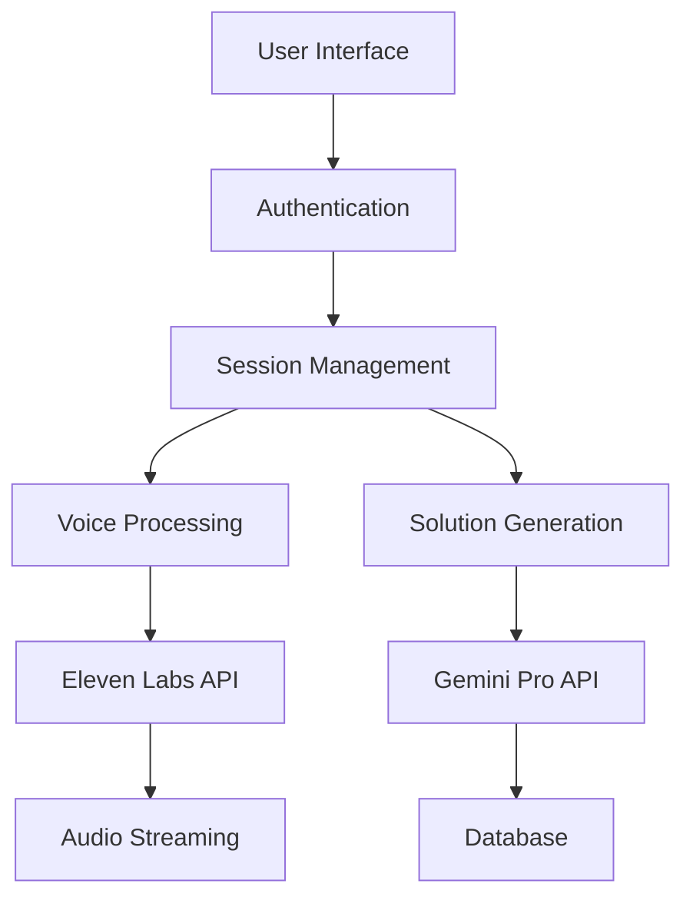
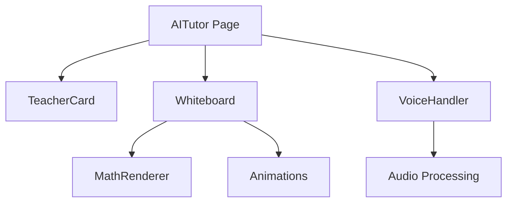

# Feature 1: AI Tutor Integration - Technical Documentation

## Table of Contents
1. [Overview](#overview)
2. [Architecture](#architecture)
3. [Database Schema](#database-schema)
4. [Components](#components)
5. [API Routes](#api-routes)
6. [Dependencies](#dependencies)
7. [Integration Points](#integration-points)
8. [Deployment Guide](#deployment-guide)
9. [Testing Strategy](#testing-strategy)
10. [Rollback Procedures](#rollback-procedures)
11. [AI Tutor Feature Implementation](#ai-tutor-feature-implementation)
12. [AI Tutor Feature Development Log](#ai-tutor-feature-development-log)
13. [Version Control Checkpoints](#version-control-checkpoints)
14. [Type Error Analysis](#type-error-analysis)

## Overview

The AI Tutor feature provides an interactive learning experience with:
- Two AI teachers (Math and Science)
- Real-time voice interaction
- Mathematical notation support
- Interactive whiteboard
- Limited demo system (2 questions)

## Architecture

### System Flow


### Component Architecture


## Database Schema

### Prisma Models
```prisma
enum TutorSubject {
  MATH
  SCIENCE
}

model TutorSession {
  id            String         @id @default(cuid())
  userId        String
  questionsLeft Int           @default(2)
  createdAt     DateTime      @default(now())
  updatedAt     DateTime      @updatedAt
  questions     TutorQuestion[]
  user          User          @relation(fields: [userId], references: [id])
}

model TutorQuestion {
  id          String       @id @default(cuid())
  sessionId   String
  question    String       @db.Text
  solution    String       @db.Text
  subject     TutorSubject
  createdAt   DateTime    @default(now())
  session     TutorSession @relation(fields: [sessionId], references: [id])
}
```

## Components

### 1. Teacher Card (`components/aitutor/teacher-card.tsx`)
- Handles teacher selection
- Manages active states
- Provides visual feedback
```typescript
interface TeacherCardProps {
  type: 'math' | 'science';
  isSelected: boolean;
  isCallActive: boolean;
  onSelect: () => void;
}
```

### 2. Whiteboard (`components/aitutor/whiteboard.tsx`)
- Displays solutions
- Handles markdown rendering
- Manages animations
```typescript
interface WhiteboardProps {
  content: string;
  isProcessing: boolean;
  selectedSubject: 'math' | 'science' | null;
  isCallActive: boolean;
}
```

### 3. Voice Handler (`components/aitutor/voice-handler.tsx`)
- Manages audio input
- Provides visual feedback
- Handles speech recognition
```typescript
interface VoiceHandlerProps {
  isCallActive: boolean;
  onSpeechResult: (text: string) => void;
  onError: (error: string) => void;
}
```

### 4. Math Renderer (`components/aitutor/math-renderer.tsx`)
- KaTeX integration
- Equation rendering
- Step-by-step solutions
```typescript
interface MathRendererProps {
  content: string;
  display?: boolean;
  className?: string;
}
```

### 5. Animations (`components/aitutor/animations.tsx`)
- Writing effects
- Chalk dust
- Loading states
```typescript
export {
  WritingAnimation,
  ChalkDust,
  EraserEffect,
  AnimatedStep,
  SpeakingIndicator,
  LoadingAnimation
}
```

## API Routes

### 1. Process Question (`/api/aitutor/process.ts`)
```typescript
POST /api/aitutor/process
Body: {
  text: string;
  subject: 'MATH' | 'SCIENCE';
}
Response: {
  solution: string;
  voicePrompt: string;
  questionsLeft: number;
}
```

### 2. Session Management (`/api/aitutor/session.ts`)
```typescript
GET /api/aitutor/session
Response: {
  questionsLeft: number;
  recentQuestions: TutorQuestion[];
}
```

## Dependencies

### Production Dependencies
```json
{
  "@google/generative-ai": "^0.1.0",
  "elevenlabs-node": "^1.0.0",
  "framer-motion": "^10.16.4",
  "katex": "^0.16.9",
  "next": "14.0.0",
  "react": "^18.2.0",
  "react-dom": "^18.2.0",
  "@prisma/client": "^5.22.0"
}
```

### Development Dependencies
```json
{
  "prisma": "^5.22.0",
  "typescript": "^5.0.0",
  "@types/katex": "^0.16.7",
  "tailwindcss": "^3.3.0"
}
```

## Integration Points

### 1. Authentication
```typescript
import { getServerSession } from 'next-auth/next';
import { authOptions } from '../auth/[...nextauth]';
```

### 2. Database
```typescript
import { prisma } from '@/lib/prisma';
```

### 3. External APIs
```typescript
const genAI = new GoogleGenerativeAI(process.env.GOOGLE_AI_KEY);
const voice = new ElevenLabs({ apiKey: process.env.ELEVEN_LABS_API_KEY });
```

## Deployment Guide

### Environment Variables
```env
GOOGLE_AI_KEY=your-gemini-key
ELEVEN_LABS_API_KEY=your-eleven-labs-key
```

### Database Migration
```bash
# Generate Prisma Client
npx prisma generate

# Run migrations
npx prisma migrate deploy
```

### Build Process
```bash
# Install dependencies
npm install

# Build application
npm run build

# Start production server
npm start
```

## Testing Strategy

### Unit Tests
- Component rendering
- Math notation
- Voice processing
- Animation states

### Integration Tests
- API endpoints
- Database operations
- External API calls

### E2E Tests
- User flow
- Question limits
- Voice interaction

## Rollback Procedures

### Database Rollback
```bash
# Revert last migration
npx prisma migrate reset
npx prisma migrate to previous_migration_name
```

### Code Rollback
1. Revert Git commits
2. Update dependencies
3. Rebuild application

### Component Removal
1. Remove routes
2. Remove components
3. Update database schema

## AI Tutor Feature Implementation

### Overview
The AI Tutor feature provides an interactive learning experience with two specialized AI tutors - one for Mathematics and one for Science.

### Components

#### 1. Layout Structure
- Uses `DashboardLayout` with white navbar for consistent dashboard experience
- Responsive grid layout with:
  - Left teacher card (1/4 width)
  - Central whiteboard (2/4 width)
  - Right teacher card (1/4 width)

#### 2. TeacherCard Component (`components/aitutor/teacher-card.tsx`)
- Displays tutor information and image
- Features:
  - Hover animations with gradient backgrounds
  - Optimized image loading with fallback to DiceBear avatars
  - Custom image positioning for each tutor
  - Interactive selection state

#### 3. Whiteboard Component (`components/aitutor/whiteboard.tsx`)
- Central interactive area for tutoring sessions
- Features:
  - Mac-style window controls
  - Loading animations
  - Markdown content rendering
  - Empty state with helpful message

#### 4. Voice Streaming Component (`components/aitutor/voice-streaming.tsx`)
- Handles audio interaction between student and AI tutor

### Styling Details
- Teacher Cards:
  - Math Teacher (Mr. David):
    - Blue gradient theme
    - Custom image positioning with horizontal flip
  - Science Teacher (Ms. Sarah):
    - Purple gradient theme
    - Centered image positioning

### Assets
- Teacher Images:
  - Math Tutor: `/public/images/avatars/math-tutor.jpg`
  - Science Tutor: `/public/images/avatars/science-tutor.jpg`
  - Fallback: DiceBear avatars with themed backgrounds

### Future Improvements
1. Add session progress tracking
2. Implement voice interaction
3. Add subject-specific tools and visualizations
4. Save and resume session functionality

## AI Tutor Feature Development Log

### Session: December 26, 2023

#### Progress Made
1. Created and tested API integration test page (`/testai`)
   - Successfully tested Gemini API integration
   - Successfully tested ElevenLabs voice generation
   - Verified proper API key configurations

2. Implemented Direct API Calls
   - ElevenLabs: Using REST API with Rachel voice (ID: 21m00Tcm4TlvDq8ikWAM)
   - Gemini: Using structured prompts for step-by-step solutions

3. Verified Core Functionality
   - Text-to-speech working with natural voice
   - Math problem solutions properly formatted
   - Both APIs integrated successfully

### Next Steps

#### Phase 1: Voice Enhancement
1. Teacher Personality Implementation
   - Create distinct voice profiles for Math and Science teachers
   - Customize ElevenLabs parameters for each teacher
   - Implement personality-specific response patterns

2. Response Processing Optimization
   - Split Gemini responses into solution and explanation
   - Format solutions for whiteboard display
   - Generate concise voice explanations

3. Interactive Features
   - Add real-time voice feedback
   - Implement visual indicators during processing
   - Add step-by-step animations

#### Phase 2: UI/UX Improvements
1. Whiteboard Enhancements
   - Add writing animations for steps
   - Include visual aids and diagrams
   - Make steps interactive and clickable

2. Teacher Interaction
   - Add teacher-specific animations
   - Implement visual feedback during voice playback
   - Create encouraging response patterns

3. Progress Tracking
   - Track question history
   - Show remaining questions counter
   - Add session summary feature

#### Phase 3: Advanced Features
1. Multi-Modal Learning
   - Combine voice, text, and visual elements
   - Generate relevant diagrams
   - Add interactive 3D models for science concepts

2. Adaptive Teaching
   - Track student comprehension
   - Adjust explanation complexity
   - Remember student preferences

3. Collaboration Features
   - Enable study groups
   - Allow teacher intervention
   - Support peer-to-peer learning

### Implementation Priority
1. Voice Enhancement (Phase 1)
   - Critical for natural interaction
   - Builds on working API integrations
   - Immediate impact on user experience

2. UI/UX Improvements (Phase 2)
   - Enhances engagement
   - Makes learning more interactive
   - Improves visual feedback

3. Advanced Features (Phase 3)
   - Adds depth to learning experience
   - Enables collaborative learning
   - Provides personalization

### Technical Requirements
1. API Integration
   - Gemini Pro API for solution generation
   - ElevenLabs API for voice synthesis
   - WebSocket for real-time interactions

2. Frontend Components
   - React components for UI elements
   - Framer Motion for animations
   - Canvas/WebGL for 3D models

3. Backend Services
   - Session management
   - Progress tracking
   - Data persistence

### Success Metrics
1. User Engagement
   - Time spent per session
   - Questions asked
   - Feature usage statistics

2. Learning Effectiveness
   - Solution comprehension
   - Question progression
   - Student feedback

3. System Performance
   - Response times
   - Voice generation quality
   - Error rates

## Version Control Checkpoints

### Current Implementation Status
**Version**: BPCAS-F1-001
**Date**: 2024-12-26
**Status**: Basic implementation complete

#### Completed Features
1. Basic AI Tutor Page Layout
   - Teacher selection (Math/Science)
   - Question limit counter (20 questions)
   - Teaching style selector

2. Whiteboard Implementation
   - Notebook-style background
   - Handwritten text styling
   - Color-coded responses
   - Line spacing optimization

3. Voice Processing Setup
   - Basic voice recording interface
   - Processing state management
   - Audio streaming preparation

#### Pending Features
1. Math Expression Rendering
   - LaTeX/KaTeX integration
   - Proper fraction display
   - Superscript/subscript handling

2. Voice Interaction Enhancement
   - Real-time voice processing
   - Silence detection
   - Response streaming

3. Teacher Personality
   - Distinct teaching styles
   - Subject-specific responses
   - Adaptive difficulty

### Commit History

#### BPCAS-F1-001 (Current)
- Initial AI Tutor implementation
- Basic whiteboard functionality
- Voice processing setup
- Components: NotebookWhiteboard, HandwrittenText
- Location: /pages/aitutor, /components/aitutor/*

To rollback to a specific version:
1. Note the version number (e.g., BPCAS-F1-001)
2. Use git checkout with the corresponding commit
3. Create a new branch if needed

### File Structure
```
/components/aitutor/
  ├── teacher-card.tsx
  ├── whiteboard.tsx
  ├── voice-handler.tsx
  ├── math-renderer.tsx
  └── animations.tsx

/pages/
  ├── aitutor/
  │   └── index.tsx
  └── api/aitutor/
      ├── process.ts
      └── session.ts

/styles/
  └── chalk.css

/public/
  ├── fonts/
  │   └── chalk.woff2
  └── images/
      ├── math-teacher.svg
      └── science-teacher.svg
```

## Type System Updates (2024-12-27)

### Previously Fixed Type Issues
1. Webhook Service
   - JSON handling improvements
   - Type-safe payload processing
   - Proper error type definitions

2. Team Member System
   - Role enumeration alignment
   - Member relationship types
   - Team permission interfaces

3. Stripe Integration
   - Subscription type definitions
   - Payment status types
   - Webhook payload types

4. Authentication System
   - Centralized types in `/lib/auth/types.ts`
   - Session type inheritance
   - User role type safety

### Current Focus
The AI Tutor components have been restored from a working state (commit `cb31412`), with test dependencies removed to simplify development. Manual testing will be used to verify functionality.

### Next Steps
1. Continue development of AI Tutor features
2. Document any new type definitions in feature1.md
3. Maintain type safety while adding new functionality

Note: All major type system issues have been resolved. The current development focus is on feature implementation rather than type system fixes.

## Performance Considerations

### Voice Processing
- Chunk size: 4096 bytes
- Buffer length: 2 seconds
- Sample rate: 44100 Hz

### Math Rendering
- KaTeX preload
- Cached computations
- Lazy loading

### Animation Performance
- GPU acceleration
- Throttled updates
- Optimized rerenders

## Security Measures

### Rate Limiting
```typescript
const rateLimit = {
  windowMs: 15 * 60 * 1000,
  max: 2
};
```

### Input Validation
- Question text sanitization
- Audio input validation
- Math expression parsing

## Monitoring

### Key Metrics
- Question success rate
- Voice recognition accuracy
- Solution generation time
- User engagement

### Error Tracking
- API failures
- Voice processing errors
- Math rendering issues

## Future Enhancements

### Phase 1 Extensions
1. Custom voice creation
2. Subject specialization
3. Progress tracking
4. Solution bookmarking

### Integration Points
1. Learning management
2. Progress dashboard
3. Analytics system
4. Content recommendation

## AI Tutor Feature Development Log

### Session: December 27, 2023

#### Progress Made
1. Fixed Voice Streaming Component
   - Improved microphone permission handling
   - Added better error states and user feedback
   - Fixed speech recognition initialization
   - Added clear visual indicators for listening state

2. Restored Original TeacherCard Design
   - Fixed height layout (450px) with three sections:
     * Image section (60%)
     * Content section (30%)
     * Status section (10%)
   - Restored gradient backgrounds:
     * Math: Blue gradient (from-blue-500/20 to-blue-600/30)
     * Science: Purple gradient (from-purple-500/20 to-purple-600/30)
   - Custom image positioning:
     * Math: Flipped horizontally, 30% left, 20% top
     * Science: Centered, 20% top
   - Interactive states:
     * Hover effects with lighter gradients
     * Selection ring in theme color
     * Disabled state with opacity

3. UI/UX Improvements
   - Added welcome message when no teacher is selected
   - Improved progress indicator animation
   - Added session status indicator
   - Better spacing and layout in the dashboard

#### Component Changes
1. VoiceStreaming (`components/aitutor/voice-streaming.tsx`)
```typescript
// Key improvements
recognition.continuous = false;
recognition.interimResults = true;
recognition.lang = 'en-US';

// Added permission handling
await navigator.mediaDevices.getUserMedia({ audio: true });

// Better error states
setError(event.error === 'not-allowed' 
  ? 'Please allow microphone access to use voice input.'
  : 'An error occurred with speech recognition.');
```

2. TeacherCard (`components/aitutor/teacher-card.tsx`)
```typescript
// Gradient configuration
const teachers = {
  math: {
    gradient: {
      bg: 'from-blue-500/20 to-blue-600/30',
      hover: 'hover:from-blue-500/10 hover:to-blue-600/20'
    }
  },
  science: {
    gradient: {
      bg: 'from-purple-500/20 to-purple-600/30',
      hover: 'hover:from-purple-500/10 hover:to-purple-600/20'
    }
  }
};

// Layout structure
<motion.div className="w-full h-[450px]">
  {/* Image Container - 60% height */}
  <div className="relative w-full h-[60%]">
    <Image className="scale-x-[-1] object-[30%_20%]" /> {/* Math teacher */}
    <Image className="object-[center_20%]" /> {/* Science teacher */}
  </div>
  
  {/* Content Container - 30% height */}
  <div className="h-[30%] bg-white">
    <h3 className="text-xl font-bold">{name}</h3>
    <p className="text-lg font-semibold">{title}</p>
  </div>
  
  {/* State Container - 10% height */}
  <div className="h-[10%] bg-black/30">
    <span>{status}</span>
  </div>
</motion.div>
```

#### Git Commit Hash
```
087f591 - Restored TeacherCard design and fixed voice streaming
```

#### Rollback Instructions
To restore this working state, use either:

1. Git commit hash:
```bash
git checkout 087f591
```

2. Git tag (recommended):
```bash
git checkout v1.0.0-teacher-card-restore
```

After rollback, verify these files:
- components/aitutor/teacher-card.tsx
- components/aitutor/voice-streaming.tsx
- pages/aitutor/index.tsx
- pages/api/aitutor/process.ts

#### Development Strategy
For future reference, to restore this working state:
```bash
git checkout v1.0.0-teacher-card-restore
```

#### Next Steps
1. Continue with AI Tutor feature enhancements
2. Focus on voice interaction improvements
3. Add more interactive whiteboard features
4. Implement subject-specific teaching styles

## AI Tutor Feature Development Log

### Session: December 27, 2023 (Part 2)

#### Progress Made
1. Fixed All Type Errors
   - Fixed TeachingStyle type in `types/aitutor.ts`
   - Fixed VoiceRecorder silenceTimeoutRef type
   - Fixed VoiceStreaming disabled prop type
   - Fixed NotebookWhiteboard selectedSubject and graphData props
   - Fixed toast usage in TeamMembers component
   - Fixed AudioContext and SpeechRecognition types in jest setup
   - Added proper type assertions in NextAuth callbacks

2. Jest Setup Improvements
   - Created proper types for mock AudioContext
   ```typescript
   type MockAudioContext = {
     createAnalyser: () => {
       connect: jest.Mock;
       disconnect: jest.Mock;
       fftSize: number;
       getByteFrequencyData: jest.Mock;
     };
     createMediaStreamSource: () => {
       connect: jest.Mock;
       disconnect: jest.Mock;
     };
   };
   ```
   - Added strategic @ts-ignore comments for browser type overrides
   - Used globalThis instead of global for setting mock implementations
   - Fixed SpeechRecognition and AudioContext type declarations

3. Git Version Control
   - Committed all changes with detailed message
   - Created tag `v1.0.0-type-errors-fixed`
   - Pushed to version3-constellation branch

#### Git Commit Details
```
commit 0cf4f85
Branch: version3-constellation
Tag: v1.0.0-type-errors-fixed
Message: fix: resolved all TypeScript errors

- Fixed TeachingStyle type in aitutor.ts
- Fixed VoiceRecorder silenceTimeoutRef type
- Fixed VoiceStreaming disabled prop type
- Fixed NotebookWhiteboard selectedSubject and graphData props
- Fixed toast usage in TeamMembers component
- Fixed AudioContext and SpeechRecognition types in jest setup
- Added proper type assertions in NextAuth callbacks
```

#### Files Modified
1. `types/aitutor.ts`
   - Updated TeachingStyle type to match working version

2. `components/aitutor/VoiceRecorder.tsx`
   - Made silenceTimeoutRef nullable

3. `components/aitutor/voice-streaming.tsx`
   - Added disabled prop to VoiceStreamingProps interface

4. `components/aitutor/NotebookWhiteboard.tsx`
   - Added selectedSubject and graphData to props interface

5. `components/teams/TeamMembers.tsx`
   - Fixed toast usage by properly destructuring from useToast hook

6. `jest.setup.ts`
   - Added proper type declarations for browser APIs
   - Improved mock implementations

7. `pages/api/auth/[...nextauth].ts`
   - Added proper type assertions in jwt and session callbacks

#### Development Strategy
For future reference, to restore this working state:
```bash
git checkout v1.0.0-type-errors-fixed
```

#### Next Steps
1. Continue with AI Tutor feature enhancements
2. Focus on voice interaction improvements
3. Add more interactive whiteboard features
4. Implement subject-specific teaching styles

## AI Tutor Feature Development Log

### Session: December 27, 2023 (Part 3)

#### Progress Made
1. Fixed MembershipTier Case Sensitivity Issue
   - Updated User model's membershipTier field to use uppercase "FREE" as default
   - Fixed type assertions in prismaAdapter
   - Updated error handling in process.ts
   - Fixed test user creation script

2. Git Version Control
   - Committed changes with detailed message
   - Pushed to version3-constellation branch

#### Git Commit Details
```
commit 0fd7b03
Branch: version3-constellation
Message: fix: update membershipTier handling

- Changed membershipTier field in User model to use uppercase FREE
- Fixed type assertions in prismaAdapter
- Updated error handling in process.ts
- Fixed test user creation script
- Fixed sign-in issue with case sensitivity
```

#### Files Modified
1. `prisma/schema.prisma`
   - Updated membershipTier field to use uppercase "FREE"

2. `lib/auth/prismaAdapter.ts`
   - Added type assertions for membershipTier compatibility

3. `pages/api/aitutor/process.ts`
   - Improved error handling for AI generation

4. `scripts/create-test-user.ts`
   - Updated test user creation to use uppercase "FREE"

#### Next Steps
1. Address remaining TypeScript errors in prismaAdapter
2. Continue with AI Tutor feature enhancements
3. Test the sign-in flow with various user types

## AI Tutor Feature Development Log

### December 27, 2023 - UI/UX Enhancements and Type Fixes
- **Commit**: c7f3ab4a7ba241cc9d0fd31dd0a710fe0f903339
- **Branch**: version3-constellation
- **Status**: All TypeScript errors fixed

#### Changes
1. UI/UX Improvements:
   - Added notebook-style whiteboard with lined paper design
   - Implemented red margin line for aesthetic appeal
   - Enhanced teacher card animations and positioning
   - Improved handwritten text rendering
   - Updated teaching style selector with smooth animations
   - Optimized content formatting for math expressions

2. TypeScript Fixes:
   - Fixed auth adapter type issues with NextAuth
   - Properly typed membershipTier enum handling
   - Added UserWithTeams type for team relationships
   - Fixed type assertions in adapter functions
   - Resolved all type errors in AI tutor components

#### Rollback Instructions
To rollback these changes if needed:
```bash
git checkout version3-constellation
git reset --hard c7f3ab4a7ba241cc9d0fd31dd0a710fe0f903339^
git push --force origin version3-constellation
```

#### Testing Notes
- Verify notebook-style whiteboard rendering
- Check teacher card animations
- Test teaching style selector
- Confirm math expression formatting
- Validate user authentication flow

#### Development Strategy
For future reference, to restore this working state:
```bash
git checkout v1.0.0-type-errors-fixed
```

#### Next Steps
1. Continue with AI Tutor feature enhancements
2. Focus on voice interaction improvements
3. Add more interactive whiteboard features
4. Implement subject-specific teaching styles
