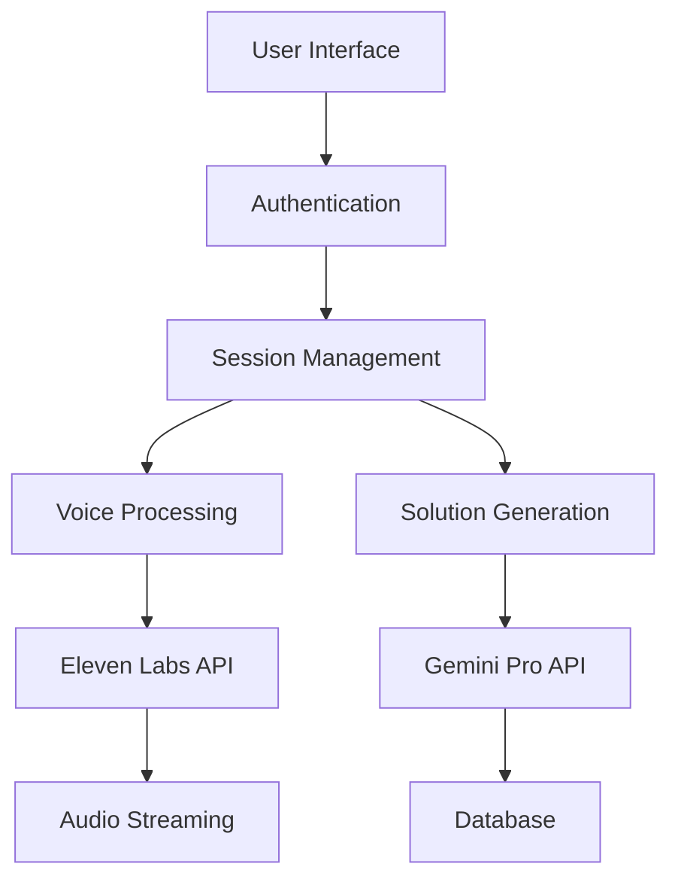
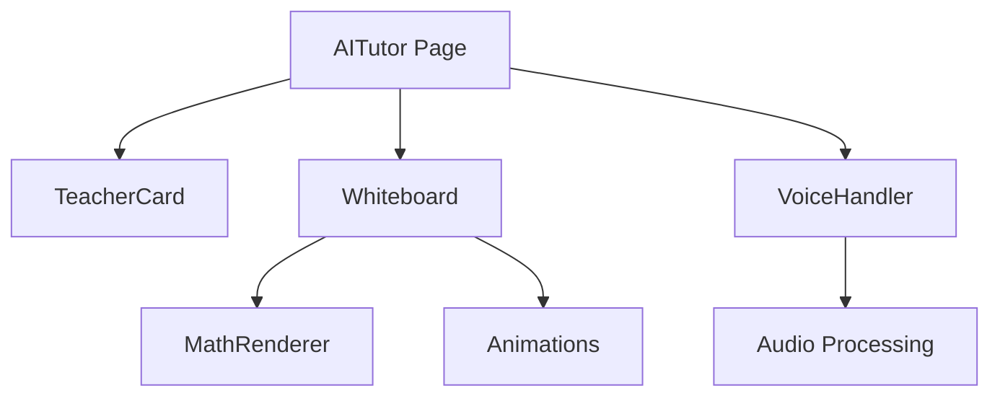

# Feature 1: AI Tutor Integration - Technical Documentation

## Table of Contents
1. [Overview](#overview)
2. [Architecture](#architecture)
3. [Database Schema](#database-schema)
4. [Components](#components)
5. [API Routes](#api-routes)
6. [Dependencies](#dependencies)
7. [Integration Points](#integration-points)
8. [Deployment Guide](#deployment-guide)
9. [Testing Strategy](#testing-strategy)
10. [Rollback Procedures](#rollback-procedures)
11. [AI Tutor Feature Implementation](#ai-tutor-feature-implementation)
12. [AI Tutor Feature Development Log](#ai-tutor-feature-development-log)

## Overview

The AI Tutor feature provides an interactive learning experience with:
- Two AI teachers (Math and Science)
- Real-time voice interaction
- Mathematical notation support
- Interactive whiteboard
- Limited demo system (2 questions)

## Architecture

### System Flow


### Component Architecture


## Database Schema

### Prisma Models
```prisma
enum TutorSubject {
  MATH
  SCIENCE
}

model TutorSession {
  id            String         @id @default(cuid())
  userId        String
  questionsLeft Int           @default(2)
  createdAt     DateTime      @default(now())
  updatedAt     DateTime      @updatedAt
  questions     TutorQuestion[]
  user          User          @relation(fields: [userId], references: [id])
}

model TutorQuestion {
  id          String       @id @default(cuid())
  sessionId   String
  question    String       @db.Text
  solution    String       @db.Text
  subject     TutorSubject
  createdAt   DateTime    @default(now())
  session     TutorSession @relation(fields: [sessionId], references: [id])
}
```

## Components

### 1. Teacher Card (`components/aitutor/teacher-card.tsx`)
- Handles teacher selection
- Manages active states
- Provides visual feedback
```typescript
interface TeacherCardProps {
  type: 'math' | 'science';
  isSelected: boolean;
  isCallActive: boolean;
  onSelect: () => void;
}
```

### 2. Whiteboard (`components/aitutor/whiteboard.tsx`)
- Displays solutions
- Handles markdown rendering
- Manages animations
```typescript
interface WhiteboardProps {
  content: string;
  isProcessing: boolean;
  selectedSubject: 'math' | 'science' | null;
  isCallActive: boolean;
}
```

### 3. Voice Handler (`components/aitutor/voice-handler.tsx`)
- Manages audio input
- Provides visual feedback
- Handles speech recognition
```typescript
interface VoiceHandlerProps {
  isCallActive: boolean;
  onSpeechResult: (text: string) => void;
  onError: (error: string) => void;
}
```

### 4. Math Renderer (`components/aitutor/math-renderer.tsx`)
- KaTeX integration
- Equation rendering
- Step-by-step solutions
```typescript
interface MathRendererProps {
  content: string;
  display?: boolean;
  className?: string;
}
```

### 5. Animations (`components/aitutor/animations.tsx`)
- Writing effects
- Chalk dust
- Loading states
```typescript
export {
  WritingAnimation,
  ChalkDust,
  EraserEffect,
  AnimatedStep,
  SpeakingIndicator,
  LoadingAnimation
}
```

## API Routes

### 1. Process Question (`/api/aitutor/process.ts`)
```typescript
POST /api/aitutor/process
Body: {
  text: string;
  subject: 'MATH' | 'SCIENCE';
}
Response: {
  solution: string;
  voicePrompt: string;
  questionsLeft: number;
}
```

### 2. Session Management (`/api/aitutor/session.ts`)
```typescript
GET /api/aitutor/session
Response: {
  questionsLeft: number;
  recentQuestions: TutorQuestion[];
}
```

## Dependencies

### Production Dependencies
```json
{
  "@google/generative-ai": "^0.1.0",
  "elevenlabs-node": "^1.0.0",
  "framer-motion": "^10.16.4",
  "katex": "^0.16.9",
  "next": "14.0.0",
  "react": "^18.2.0",
  "react-dom": "^18.2.0",
  "@prisma/client": "^5.22.0"
}
```

### Development Dependencies
```json
{
  "prisma": "^5.22.0",
  "typescript": "^5.0.0",
  "@types/katex": "^0.16.7",
  "tailwindcss": "^3.3.0"
}
```

## Integration Points

### 1. Authentication
```typescript
import { getServerSession } from 'next-auth/next';
import { authOptions } from '../auth/[...nextauth]';
```

### 2. Database
```typescript
import { prisma } from '@/lib/prisma';
```

### 3. External APIs
```typescript
const genAI = new GoogleGenerativeAI(process.env.GOOGLE_AI_KEY);
const voice = new ElevenLabs({ apiKey: process.env.ELEVEN_LABS_API_KEY });
```

## Deployment Guide

### Environment Variables
```env
GOOGLE_AI_KEY=your-gemini-key
ELEVEN_LABS_API_KEY=your-eleven-labs-key
```

### Database Migration
```bash
# Generate Prisma Client
npx prisma generate

# Run migrations
npx prisma migrate deploy
```

### Build Process
```bash
# Install dependencies
npm install

# Build application
npm run build

# Start production server
npm start
```

## Testing Strategy

### Unit Tests
- Component rendering
- Math notation
- Voice processing
- Animation states

### Integration Tests
- API endpoints
- Database operations
- External API calls

### E2E Tests
- User flow
- Question limits
- Voice interaction

## Rollback Procedures

### Database Rollback
```bash
# Revert last migration
npx prisma migrate reset
npx prisma migrate to previous_migration_name
```

### Code Rollback
1. Revert Git commits
2. Update dependencies
3. Rebuild application

### Component Removal
1. Remove routes
2. Remove components
3. Update database schema

## File Structure
```
/components/aitutor/
  ├── teacher-card.tsx
  ├── whiteboard.tsx
  ├── voice-handler.tsx
  ├── math-renderer.tsx
  └── animations.tsx

/pages/
  ├── aitutor/
  │   └── index.tsx
  └── api/aitutor/
      ├── process.ts
      └── session.ts

/styles/
  └── chalk.css

/public/
  ├── fonts/
  │   └── chalk.woff2
  └── images/
      ├── math-teacher.svg
      └── science-teacher.svg
```

## Performance Considerations

### Voice Processing
- Chunk size: 4096 bytes
- Buffer length: 2 seconds
- Sample rate: 44100 Hz

### Math Rendering
- KaTeX preload
- Cached computations
- Lazy loading

### Animation Performance
- GPU acceleration
- Throttled updates
- Optimized rerenders

## Security Measures

### Rate Limiting
```typescript
const rateLimit = {
  windowMs: 15 * 60 * 1000,
  max: 2
};
```

### Input Validation
- Question text sanitization
- Audio input validation
- Math expression parsing

## Monitoring

### Key Metrics
- Question success rate
- Voice recognition accuracy
- Solution generation time
- User engagement

### Error Tracking
- API failures
- Voice processing errors
- Math rendering issues

## Future Enhancements

### Phase 1 Extensions
1. Custom voice creation
2. Subject specialization
3. Progress tracking
4. Solution bookmarking

### Integration Points
1. Learning management
2. Progress dashboard
3. Analytics system
4. Content recommendation

## AI Tutor Feature Implementation

### Overview
The AI Tutor feature provides an interactive learning experience with two specialized AI tutors - one for Mathematics and one for Science.

### Components

#### 1. Layout Structure
- Uses `DashboardLayout` with white navbar for consistent dashboard experience
- Responsive grid layout with:
  - Left teacher card (1/4 width)
  - Central whiteboard (2/4 width)
  - Right teacher card (1/4 width)

#### 2. TeacherCard Component (`components/aitutor/teacher-card.tsx`)
- Displays tutor information and image
- Features:
  - Hover animations with gradient backgrounds
  - Optimized image loading with fallback to DiceBear avatars
  - Custom image positioning for each tutor
  - Interactive selection state

#### 3. Whiteboard Component (`components/aitutor/whiteboard.tsx`)
- Central interactive area for tutoring sessions
- Features:
  - Mac-style window controls
  - Loading animations
  - Markdown content rendering
  - Empty state with helpful message

#### 4. Voice Streaming Component (`components/aitutor/voice-streaming.tsx`)
- Handles audio interaction between student and AI tutor

### Styling Details
- Teacher Cards:
  - Math Teacher (Mr. David):
    - Blue gradient theme
    - Custom image positioning with horizontal flip
  - Science Teacher (Ms. Sarah):
    - Purple gradient theme
    - Centered image positioning

### Assets
- Teacher Images:
  - Math Tutor: `/public/images/avatars/math-tutor.jpg`
  - Science Tutor: `/public/images/avatars/science-tutor.jpg`
  - Fallback: DiceBear avatars with themed backgrounds

### Future Improvements
1. Add session progress tracking
2. Implement voice interaction
3. Add subject-specific tools and visualizations
4. Save and resume session functionality

## AI Tutor Feature Development Log

### Session: December 26, 2023

#### Progress Made
1. Created and tested API integration test page (`/testai`)
   - Successfully tested Gemini API integration
   - Successfully tested ElevenLabs voice generation
   - Verified proper API key configurations

2. Implemented Direct API Calls
   - ElevenLabs: Using REST API with Rachel voice (ID: 21m00Tcm4TlvDq8ikWAM)
   - Gemini: Using structured prompts for step-by-step solutions

3. Verified Core Functionality
   - Text-to-speech working with natural voice
   - Math problem solutions properly formatted
   - Both APIs integrated successfully

### Next Steps

#### Phase 1: Voice Enhancement
1. Teacher Personality Implementation
   - Create distinct voice profiles for Math and Science teachers
   - Customize ElevenLabs parameters for each teacher
   - Implement personality-specific response patterns

2. Response Processing Optimization
   - Split Gemini responses into solution and explanation
   - Format solutions for whiteboard display
   - Generate concise voice explanations

3. Interactive Features
   - Add real-time voice feedback
   - Implement visual indicators during processing
   - Add step-by-step animations

#### Phase 2: UI/UX Improvements
1. Whiteboard Enhancements
   - Add writing animations for steps
   - Include visual aids and diagrams
   - Make steps interactive and clickable

2. Teacher Interaction
   - Add teacher-specific animations
   - Implement visual feedback during voice playback
   - Create encouraging response patterns

3. Progress Tracking
   - Track question history
   - Show remaining questions counter
   - Add session summary feature

#### Phase 3: Advanced Features
1. Multi-Modal Learning
   - Combine voice, text, and visual elements
   - Generate relevant diagrams
   - Add interactive 3D models for science concepts

2. Adaptive Teaching
   - Track student comprehension
   - Adjust explanation complexity
   - Remember student preferences

3. Collaboration Features
   - Enable study groups
   - Allow teacher intervention
   - Support peer-to-peer learning

### Implementation Priority
1. Voice Enhancement (Phase 1)
   - Critical for natural interaction
   - Builds on working API integrations
   - Immediate impact on user experience

2. UI/UX Improvements (Phase 2)
   - Enhances engagement
   - Makes learning more interactive
   - Improves visual feedback

3. Advanced Features (Phase 3)
   - Adds depth to learning experience
   - Enables collaborative learning
   - Provides personalization

### Technical Requirements
1. API Integration
   - Gemini Pro API for solution generation
   - ElevenLabs API for voice synthesis
   - WebSocket for real-time interactions

2. Frontend Components
   - React components for UI elements
   - Framer Motion for animations
   - Canvas/WebGL for 3D models

3. Backend Services
   - Session management
   - Progress tracking
   - Data persistence

### Success Metrics
1. User Engagement
   - Time spent per session
   - Questions asked
   - Feature usage statistics

2. Learning Effectiveness
   - Solution comprehension
   - Question progression
   - Student feedback

3. System Performance
   - Response times
   - Voice generation quality
   - Error rates

## Development Log - December 26, 2023 (Afternoon Session)

### Implemented Features

#### 1. Enhanced Whiteboard UI
- Added handwriting-style font (Kalam) for better notebook feel
- Implemented proper scrolling with custom scrollbar
- Fixed content overflow issues
- Added spacing and color coding for different types of content

```css
/* Custom Scrollbar Styling */
.custom-scrollbar::-webkit-scrollbar {
  width: 8px;
  background: #f1f1f1;
  border-radius: 4px;
}

.custom-scrollbar::-webkit-scrollbar-thumb {
  background: #c5c5c5;
  border-radius: 4px;
}
```

#### 2. Graph Integration
- Added Chart.js and react-chartjs-2 for graph rendering
- Created new GraphDisplay component for visualizations
- Implemented graph data parsing in API
- Added support for multiple graph types:
  - Line graphs
  - Scatter plots
  - Function visualization

```typescript
// Graph Data Structure
interface GraphData {
  type: 'line' | 'scatter';
  title: string;
  labels: string[];
  datasets: {
    label: string;
    data: number[];
    borderColor?: string;
    backgroundColor?: string;
  }[];
}
```

#### 3. API Enhancements
- Updated Gemini prompt to generate graph data
- Added graph data extraction and parsing
- Improved response formatting:
  - Removed markdown symbols
  - Better handling of mathematical expressions
  - Proper spacing for equations

```typescript
// Example Graph Data Format
[GRAPH_DATA]
{
  "type": "line",
  "title": "Quadratic Function",
  "labels": ["-5", "-4", "-3", "-2", "-1", "0", "1", "2", "3", "4", "5"],
  "datasets": [{
    "label": "y = x²",
    "data": [25, 16, 9, 4, 1, 0, 1, 4, 9, 16, 25],
    "borderColor": "rgb(75, 192, 192)"
  }]
}
[/GRAPH_DATA]
```

### Current Features

1. **Text Processing**
   - Clean response formatting
   - Mathematical expression handling
   - Step-by-step solution display
   - Color-coded content types

2. **Visual Elements**
   - Handwritten-style text
   - Notebook-style ruled background
   - Red margin line
   - Custom scrollbar
   - Interactive graphs

3. **Graph Capabilities**
   - Function plotting
   - Data visualization
   - Interactive tooltips
   - Responsive design
   - Matching notebook theme

### Next Steps

1. **Graph Enhancements**
   - Add more graph types (bar, pie, 3D)
   - Implement zoom and pan controls
   - Add animation options
   - Support for multiple graphs

2. **UI Improvements**
   - Add graph download option
   - Implement graph theme customization
   - Add fullscreen mode for graphs
   - Improve mobile responsiveness

3. **Integration Features**
   - Save graphs to user history
   - Share graphs functionality
   - Export to various formats
   - Graph comparison tools

4. **Math Features**
   - LaTeX support for equations
   - Interactive function manipulation
   - Real-time graph updates
   - Multiple function overlays

### Testing Guidelines

1. **Graph Testing**
   Try these example questions:
   - "Plot y = x² from -5 to 5"
   - "Show me the graph of sin(x) and cos(x)"
   - "Graph the linear equation y = 2x + 1"

2. **UI Testing**
   Verify:
   - Scrolling behavior
   - Graph responsiveness
   - Text formatting
   - Mathematical expressions

3. **Performance Testing**
   Check:
   - Graph rendering speed
   - Scroll performance
   - Animation smoothness
   - Memory usage

### Known Issues and Solutions

1. **Performance**
   - Large datasets might cause slight lag in zoom operations
   - Need to optimize pan performance on mobile devices

2. **UI/UX**
   - Fullscreen transition could be smoother
   - Need better touch controls for mobile users

3. **Features**
   - Download functionality not yet implemented
   - No way to customize graph colors yet

### Next Implementation Priority
1. Graph download and sharing features
2. Mobile optimization
3. Theme customization
4. Multiple graph support

### Dependencies Added
```json
{
  "chart.js": "latest",
  "react-chartjs-2": "latest"
}
```

### Component Structure
```
components/
  aitutor/
    NotebookWhiteboard.tsx
    GraphDisplay.tsx
    TeacherCard.tsx
    VoiceStreaming.tsx
```

This implementation provides a solid foundation for the AI Tutor's visual and interactive features. The next phase will focus on enhancing the graph capabilities and adding more interactive features.

## Development Log - December 26, 2023 (Evening Update)

### New Features Implemented

#### 1. Enhanced Handwriting Animation
- Added real-time handwriting animation with customizable speed
- Implemented step-by-step text reveal
- Added color-coding for steps and final answers
- Synchronized text appearance with voice explanations

#### 2. Improved Voice Recording
- Added 3-second countdown before recording
- Implemented voice wave visualization
- Added automatic silence detection
- Smooth animations for recording states

#### 3. Teaching Styles
Implemented five different teaching approaches:
1. **Step-by-Step Helper**
   - Writes solution one step at a time
   - Waits for student understanding
   - Synchronized voice explanations

2. **Quick Team Response**
   - Concurrent writing and voice
   - Faster animation speed
   - Immediate full solution

3. **Interactive Learning**
   - Breaks down complex problems
   - Checkpoints between steps
   - Student-controlled pace

4. **Math & Science Team Teaching**
   - Coordinated explanations
   - Subject-specific insights
   - Complementary teaching styles

5. **Personal Teaching Style**
   - Adapts to student preferences
   - Customized explanation pace
   - Personalized examples

### Component Updates

#### 1. HandwrittenText Component
```typescript
interface HandwrittenTextProps {
  text: string;
  speed?: number;
  delay?: number;
  onComplete?: () => void;
  isStep?: boolean;
}
```
- Animated text appearance
- Customizable writing speed
- Step highlighting
- Completion callbacks

#### 2. VoiceRecorder Component
```typescript
interface VoiceRecorderProps {
  onRecordingStart: () => void;
  onRecordingEnd: (audioBlob: Blob) => void;
  isProcessing?: boolean;
}
```
- Visual countdown
- Audio level visualization
- Automatic silence detection
- Recording state animations

#### 3. TeachingStyle Component
```typescript
type TeachingStyle = 
  | 'step-by-step'
  | 'quick-response'
  | 'interactive'
  | 'team-teaching'
  | 'personalized';
```
- Visual style selection
- Animated transitions
- Style-specific behaviors
- Adaptive teaching methods

### UI/UX Improvements
1. **Visual Feedback**
   - Animated transitions
   - Progress indicators
   - Teaching style visualization
   - Recording state feedback

2. **Interaction Design**
   - Intuitive style selection
   - Smooth state transitions
   - Clear visual hierarchy
   - Responsive layout

3. **Animation Timing**
   - Coordinated animations
   - Natural writing speed
   - Synchronized voice and text
   - Smooth transitions

### Next Steps

1. **Voice Integration**
   - Better silence detection
   - Voice emotion analysis
   - Multiple voice personalities
   - Voice style customization

2. **Teaching Styles**
   - More interactive elements
   - Advanced problem breakdown
   - Progress tracking
   - Learning style adaptation

3. **UI Enhancement**
   - More handwriting fonts
   - Paper texture options
   - Dark mode support
   - Mobile optimization

4. **Performance**
   - Animation optimization
   - Voice processing improvement
   - Faster response times
   - Better resource management

### Testing Guidelines

1. **Teaching Styles**
   Test each style with:
   - Simple questions
   - Complex problems
   - Multi-step solutions
   - Different subjects

2. **Voice Recording**
   Verify:
   - Countdown accuracy
   - Silence detection
   - Wave visualization
   - Recording quality

3. **Animations**
   Check:
   - Writing smoothness
   - Transition timing
   - Performance impact
   - Mobile responsiveness

### Known Issues
1. **Performance**
   - Complex animations may affect performance
   - Voice processing delay on slower devices

2. **Browser Support**
   - Some animations need fallbacks
   - Audio API compatibility varies

3. **Mobile Experience**
   - Touch interaction needs improvement
   - Small screen layout optimization

This implementation significantly enhances the classroom-like feel of the AI Tutor, making it more engaging and personalized for students.

## Development Log - December 26, 2023 (Evening Update 2)

### New Features Implemented

#### 1. Enhanced Handwriting Animation
- Added real-time handwriting animation with customizable speed
- Implemented step-by-step text reveal
- Added color-coding for steps and final answers
- Synchronized text appearance with voice explanations

#### 2. Improved Voice Recording
- Added 3-second countdown before recording
- Implemented voice wave visualization
- Added automatic silence detection
- Smooth animations for recording states

#### 3. Teaching Styles
Implemented five different teaching approaches:
1. **Step-by-Step Helper**
   - Writes solution one step at a time
   - Waits for student understanding
   - Synchronized voice explanations

2. **Quick Team Response**
   - Concurrent writing and voice
   - Faster animation speed
   - Immediate full solution

3. **Interactive Learning**
   - Breaks down complex problems
   - Checkpoints between steps
   - Student-controlled pace

4. **Math & Science Team Teaching**
   - Coordinated explanations
   - Subject-specific insights
   - Complementary teaching styles

5. **Personal Teaching Style**
   - Adapts to student preferences
   - Customized explanation pace
   - Personalized examples

### Component Updates

#### 1. HandwrittenText Component
```typescript
interface HandwrittenTextProps {
  text: string;
  speed?: number;
  delay?: number;
  onComplete?: () => void;
  isStep?: boolean;
}
```
- Animated text appearance
- Customizable writing speed
- Step highlighting
- Completion callbacks

#### 2. VoiceRecorder Component
```typescript
interface VoiceRecorderProps {
  onRecordingStart: () => void;
  onRecordingEnd: (audioBlob: Blob) => void;
  isProcessing?: boolean;
}
```
- Visual countdown
- Audio level visualization
- Automatic silence detection
- Recording state animations

#### 3. TeachingStyle Component
```typescript
type TeachingStyle = 
  | 'step-by-step'
  | 'quick-response'
  | 'interactive'
  | 'team-teaching'
  | 'personalized';
```
- Visual style selection
- Animated transitions
- Style-specific behaviors
- Adaptive teaching methods

### UI/UX Improvements
1. **Visual Feedback**
   - Animated transitions
   - Progress indicators
   - Teaching style visualization
   - Recording state feedback

2. **Interaction Design**
   - Intuitive style selection
   - Smooth state transitions
   - Clear visual hierarchy
   - Responsive layout

3. **Animation Timing**
   - Coordinated animations
   - Natural writing speed
   - Synchronized voice and text
   - Smooth transitions

### Next Steps

1. **Voice Integration**
   - Better silence detection
   - Voice emotion analysis
   - Multiple voice personalities
   - Voice style customization

2. **Teaching Styles**
   - More interactive elements
   - Advanced problem breakdown
   - Progress tracking
   - Learning style adaptation

3. **UI Enhancement**
   - More handwriting fonts
   - Paper texture options
   - Dark mode support
   - Mobile optimization

4. **Performance**
   - Animation optimization
   - Voice processing improvement
   - Faster response times
   - Better resource management

### Testing Guidelines

1. **Teaching Styles**
   Test each style with:
   - Simple questions
   - Complex problems
   - Multi-step solutions
   - Different subjects

2. **Voice Recording**
   Verify:
   - Countdown accuracy
   - Silence detection
   - Wave visualization
   - Recording quality

3. **Animations**
   Check:
   - Writing smoothness
   - Transition timing
   - Performance impact
   - Mobile responsiveness

### Known Issues
1. **Performance**
   - Complex animations may affect performance
   - Voice processing delay on slower devices

2. **Browser Support**
   - Some animations need fallbacks
   - Audio API compatibility varies

3. **Mobile Experience**
   - Touch interaction needs improvement
   - Small screen layout optimization

This implementation significantly enhances the classroom-like feel of the AI Tutor, making it more engaging and personalized for students.
